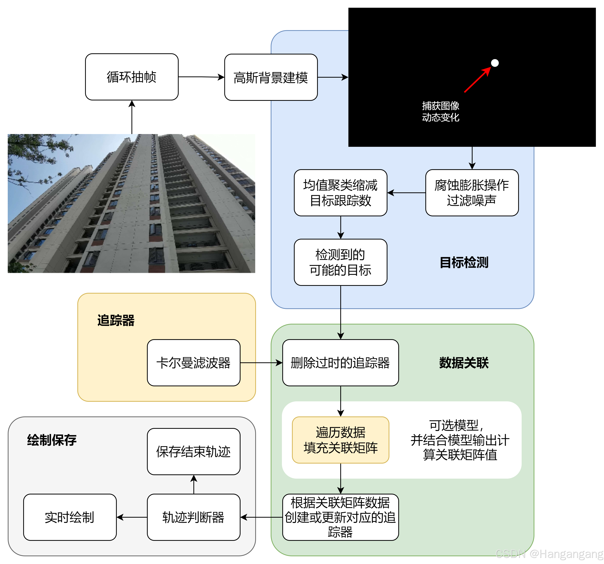
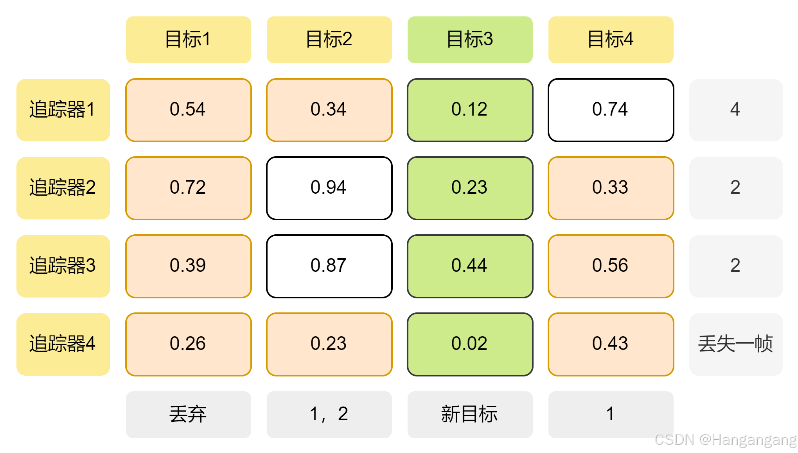
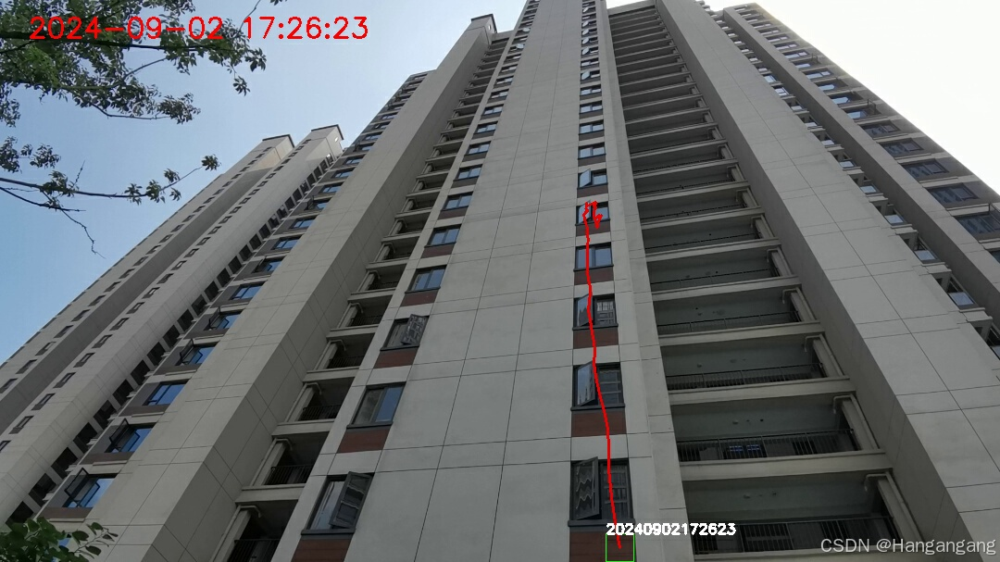

# 高空抛物轨迹追踪

**详细内容：**

✨[CSDN文章连接](https://blog.csdn.net/m0_57254760/article/details/141830031)

## 文件路径

root:.
├─associate	关联器，提供两个版本
├─conf	配置文件
├─data
│  └─video	测试视频
├─model	模型
├─save	保存目录
├─target	目标检测
├─tracker	目标追踪
└─utils	计算DIOU等

**注：模型说明**：[HuggingFace-Vit msn](https://huggingface.co/docs/transformers/v4.24.0/en/model_doc/vit_msn)😂

选用小型模型，使用`transformers`库读取。

- 需要下载模型到本地并修改`vit_small.py`文件中的模型路径

- 或者直接采用官网方式加载模型到缓存中

## 配置文件

本代码提供全局配置文件，按照实际应用场景修改配置即可。

```yaml
# 用于图像膨胀腐蚀操作的核大小
kernel_size:
  width: 4
  height: 4

background_subtractor:
  history: 100 # 卡尔曼滤波器背景建模帧数
  var_threshold: 45 # 背景变化范围
  detect_shadows: False # 是否检测背景
  min_detect_object: 5 # 最小探测物体大小

kalman_filter:
  max_missed_frames: 30 # 追踪器允许的最长目标跟踪丢失帧数
  max_tracked_frames: 500 # 最长的目标追踪帧数
  max_filter_count: 10 # 同时追踪的最大数目
  min_confidence: 0.5 # 可信度


image:
  min_show_num: 10 # 可展示的轨迹最小记录帧数
  size: 40 # 图片相似度或DIOU计算截取图片大小

save:
  #  检测结果保存路径,路径从项目根目录开始
  save_path: './save/'
```

## 算法结构
下图展示了本算法的结构。算法核心由三部分构成，在显式代码编写中也分为三部分
- 目标检测
- 数据关联
- 目标追踪

算法处理的数据是具有`时序信息`的图像帧，每次输入一帧图像，目标检测器识别出移动的`主体`（即分离出背景和前景）。获取到的目标（前景）以中心点坐标形式。算法维护一个始终贯穿整个时序的`追踪器队列`，针对每次出现的目标都会做出两种判断：
（a）此目标是否可以和已有追踪器**最优**关联；
（b）此目标是否为新目标。
这样每一帧结束要么会有新的关联产生，要么更新关联，要么删除关联。最终，在一个个追踪器中记录的轨迹信息经过判断后将以适合的方式展示。



## 目标检测
高空抛物的物体复杂，使用成熟的目标检测算法（YOLO等）难以囊括，主要的方法可参看：
[高空抛物监测Opencv+SORT](https://blog.csdn.net/kalahali/article/details/129308333)
本算法选用常用的高斯背景建模，并对建模后的图像进行形态学操作去除一部分噪声。针对镜头中移动物体过多导致的追踪器溢出，在图像去噪之后又使用了*均值聚类算法*，这一操作明显过滤了画面大幅扰动带来的性能风险。

## 目标追踪与数据关联
目标追踪是从上一帧（或之前）追踪目标与当前帧识别出的目标进行匹配，量化来看就是对每个目标和每个追踪进行置信度的计算，实际上就是一个二维的关联矩阵。矩阵的每个值代表这个目标与当前追踪器能够匹配的可信程度。

> 常见的目标追踪算法又**DeepSort**与**ByteSort**算法等，这些算法尝试找到最优的匹配方式。
> **参看：**[目标追踪DeepSORT与ByteTrack](https://blog.csdn.net/lishijin5421/article/details/127867265).

本算法是简化版本，基于高空抛物的目标检测之困难，我们实际上难以获得目标框及其置信度的信息。算法尝试使用简化的`DIOU`来衡量卡尔曼滤波器下一步预测与测量值之间的距离。算法对计算出的中心坐标进行**矩形框复原**，你可以在配置文件中更改矩形框的大小。这个简化的计算方式如下:
$$
DIOU=1-\frac{d}{D}
$$
这样,如果期望引入计算图片相似度模型可以分配不同的权重来衡量关联的指标。
下面的代码完整展示了不使用相似度模型来进行最优关联的算法，算法维护了一个`数据关联矩阵`，以简化的`DIOU`作为唯一的置信度，并且假设置信度`大于0.5`即采用。
对于数据关联矩阵分别**扫描横竖**记录最大值，对追踪器而言如果**没有关联**目标则丢失追踪一帧，对目标而言如果**全部都匹配不上**则新建追踪器。

> 你可能会注意到下图*有一个目标被同时分配到两个追踪器*，实际上由于高空抛物目标的特性这种情况并不产生明显影响，更进一步当前算法没有关注图像本身的信息所以本质上无法完全判断谁会更好，你也可以尝试修改这一点。



## 保存图片🖼️
算法通过轨迹判断在适当的时候显示轨迹，并在目标消失后记录轨迹图片.

